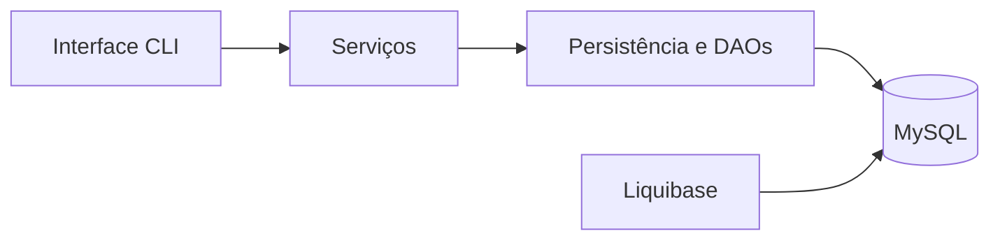

# Board Manager

[](https://www.oracle.com/java/)
[](https://gradle.org/)
[](https://www.mysql.com/)
[](https://www.liquibase.com/)
[](https://github.com/talitagroberto/board/actions/workflows/ci.yml)

Sistema de gerenciamento de boards e cards desenvolvido em Java. A aplicação utiliza uma interface de linha de comando, persistência em MySQL e controle de versão do banco de dados com Liquibase.

## Funcionalidades

- Criar, consultar e excluir boards.
- Personalizar as colunas de cada board.
- Criar cards com título e descrição.
- Mover cards entre as etapas do fluxo.
- Bloquear e desbloquear cards com registro do motivo.
- Cancelar cards.
- Consultar boards, colunas e cards.
- Validar entradas informadas pelo usuário.
- Executar migrações do banco automaticamente.
- Compilar e testar o projeto com GitHub Actions.

## Regras de negócio

Cada board possui:

- Uma coluna inicial.
- Uma ou mais colunas pendentes.
- Uma coluna final.
- Uma coluna de cancelamento.

Um card bloqueado não pode ser movimentado até que seja desbloqueado. Cards concluídos ou cancelados não podem retornar ao fluxo normal.

## Arquitetura



```text
src/main/java/br/com/dio
├── dto            # Objetos de transferência de dados
├── exception      # Exceções de negócio
├── persistence    # Configuração, entidades, DAOs e migrações
├── service        # Regras de negócio
├── ui             # Menus da aplicação
└── Main.java      # Ponto de entrada
```

## Tecnologias

- Java 21
- Gradle
- MySQL
- JDBC
- Liquibase
- Lombok
- JUnit 5
- GitHub Actions

## Pré-requisitos

Antes de executar, instale:

- JDK 21
- MySQL 8 ou superior
- Git

Não é necessário instalar o Gradle, pois o projeto possui Gradle Wrapper.

## Configuração do banco de dados

Crie o banco:

```sql
CREATE DATABASE board
    CHARACTER SET utf8mb4
    COLLATE utf8mb4_unicode_ci;
```

A aplicação utiliza estas variáveis de ambiente:

| Variável | Descrição | Exemplo |
|---|---|---|
| `BOARD_DB_URL` | URL JDBC do banco | `jdbc:mysql://localhost:3306/board` |
| `BOARD_DB_USER` | Usuário do MySQL | `board` |
| `BOARD_DB_PASSWORD` | Senha do MySQL | `sua_senha` |

O arquivo `.env.example` contém um modelo de configuração. Ele serve apenas como referência; as variáveis devem ser configuradas no sistema operacional.

### Windows PowerShell

```powershell
$env:BOARD_DB_URL="jdbc:mysql://localhost:3306/board"
$env:BOARD_DB_USER="board"
$env:BOARD_DB_PASSWORD="sua_senha"
```

### Linux ou macOS

```bash
export BOARD_DB_URL="jdbc:mysql://localhost:3306/board"
export BOARD_DB_USER="board"
export BOARD_DB_PASSWORD="sua_senha"
```

## Execução

Clone o repositório:

```bash
git clone https://github.com/talitagroberto/board.git
cd board
```

No Windows:

```powershell
.\gradlew.bat run
```

No Linux ou macOS:

```bash
chmod +x gradlew
./gradlew run
```

Na primeira execução, o Liquibase criará automaticamente as tabelas necessárias.

## Compilação e testes

No Windows:

```powershell
.\gradlew.bat clean build
```

No Linux ou macOS:

```bash
./gradlew clean build
```

Cada `push` e `pull request` também executa a compilação automaticamente pelo GitHub Actions.

## Projeto de referência

Projeto desenvolvido como desafio prático da [Digital Innovation One](https://www.dio.me/), com base no [repositório oficial](https://github.com/digitalinnovationone/board).

## Autoria

Desenvolvido por [Talita Gonçalves](https://github.com/talitagroberto).